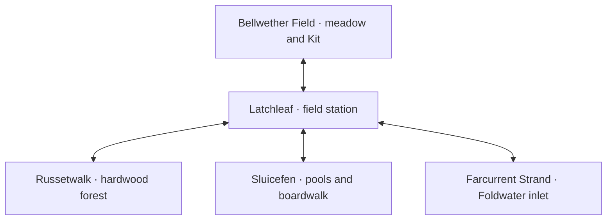

# Foldwater Reach

Foldwater Reach is a lightly fantastical early-autumn landscape inspired by the Eastern Woodlands of North America. Its identity comes from deciduous canopy, leaf litter, damp logs, migrating insects, meadow flowers, wetland pools, rural wooden structures, and tidal water. There is one settlement and four small surrounding habitats. It does not represent a real reserve or claim that the entire roster shares one natural range.

The **Foldwater seam** is an explicitly fictional connection between distant waters and sanctuary arrangements. Pacific visitors and large ocean companions can remain in suitable waters while briefly accompanying fieldwork. The journal separates actual range and biological inspiration from the fantasy. Southern reptiles and the plains bison have sanctuary reference plates and developer test encounters; this slice does not place them into the ordinary Eastern Woodlands encounter tables.

## Layout and traversal

Latchleaf provides north, west, east, and south departures. Each habitat returns directly to town by its southern marked path. Areas do not connect to one another directly. Every map is **25 by 17 tiles** at a logical tile size of **16 pixels**, viewed through a 320×240 scrolling camera. A new arrival starts on a safe path; field arrivals use tile `(12,14)` and their town return landmark is `(12,15)`. Town's central spawn is `(12,10)`.

Trees, buildings, and deep water block walking. Gravel paths do not trigger random encounters. The central paths connect all landmarks, so observations and returns remain reachable without a special creature, consumable, or combat win. Pointer walking and **START → Area Map** use a weighted pathfinder that favors safe gravel, with the same collision rules as manual movement. The menu's **Search Nearby Habitat** intentionally permits a direct encounter from anywhere in a wilderness map. Manual interaction requires facing the landmark; the player turns even when the adjacent tile blocks movement.

The terrain is generated deterministically from each map's definition; it is a fixed compact layout, not a procedural open world. The early slice prioritizes legibility and a reliable return route over maze navigation.

## Latchleaf

The settlement is a working field station with a noticeboard, three wooden buildings, a small planted plot, and four departures. Its roof shapes, paths, building positions, and service arrangement are original.

| Landmark               | Function                                                                                |
| ---------------------- | --------------------------------------------------------------------------------------- |
| Pathwarden Nella Quill | Introduces fieldwalking, offers starters, and evaluates the Fourfold Ramble             |
| The Kettle House       | Free Kettle rest for all walking-company and home-roost companions                      |
| Moss & Sundries        | Sells invitation ribbons and broth wraps; offers a free minimum kit                     |
| Field station notice   | Explains the Foldwater seam and the distinction between real ranges and visiting Cromon |
| Four marked departures | Direct access to the four habitats                                                      |

Nella is practical and warm. Her concern is that walkers pay attention and return safely. No laboratory selection scene, academic authority institution, league, or badge structure is involved. Kit is a fellow novice with an excessively elaborate note-coloring system.

## Four habitats

| Area                  | Ecological and visual identity                                                  | Small field interaction                                        | First discovery reward                 | Recorded sighting                       |
| --------------------- | ------------------------------------------------------------------------------- | -------------------------------------------------------------- | -------------------------------------- | --------------------------------------- |
| **Russetwalk**        | Hardwood trunks, russet canopy, leaf litter, damp shelter; deep green and amber | Lift and prop a fallen branch without disturbing its residents | 2 invitation ribbons and 8 field chits | Dapploom, the spotted salamander Cromon |
| **Bellwether Field**  | Goldenrod, asters, open golden ground, migrating insects                        | Turn a listening vane to read the migration counter            | 1 broth wrap and 8 field chits         | Pennamber, the monarch Cromon           |
| **Sluicefen**         | Reed-fringed pools, muddy green ground, plank-like marked routes, blue water    | Turn a spillway wheel a quarter turn                           | 2 invitation ribbons and 8 field chits | Stiltscribe, the heron Cromon           |
| **Farcurrent Strand** | Sand-colored banks, salt air, tide pools, dark teal inlet water                 | Lower the tide lens to look beneath the foam                   | 1 broth wrap and 8 field chits         | Hingehaven, the horseshoe-crab Cromon   |

Each area has a naturalist note at `(6,10)`, its discovery at `(12,5)`, and its return landmark. The notes discuss box-turtle shell anatomy, monarch migration, wetland function, and the actual ranges of visiting marine animals. They mix useful observation with occasional original jokes.

The interactions change the field report and grant their reward only once. They also visibly change the map: the branch is raised onto a prop, the vane turns, the spillway structure lifts, and the tide lens lowers into the water and reveals a pale viewing area. `FieldScene` reads the saved discoveries to draw each before-or-after state, so the changes survive a reload. They do not alter collision or gate traversal; every return route remains available before the observation.

## Kit's friendly bout

Kit waits at `(17,8)` in Bellwether Field and offers a supervised comparison of field techniques. The company is fully rested, including technique uses, before the battle. Kit fields a level-three Choiruff. A win marks the assignment objective; losing leaves it available for another attempt. The agreed human bout does not permit running or recruitment. A completed bout remains replayable.

## Scope and ecology

Twenty-six distinct species occur across the four encounter tables, including uncommon inland animals and rare Foldwater marine visitors. Dewlapp, Scutapult, Rumbison, and Needlegape are sanctuary visitors available in the developer showcase. All thirty can be inspected in the ordinary journal. See [encounter tables](encounter-tables.md) for exact weights and availability, and the [roster index](../cromon/README.md) for individual actual ranges and biology sources.

The landscape provides the setting's cultural restraint: there are no invented sacred traditions, generic tribal symbols, totems, or generalized spirit-animal language. Local institutions are mundane fieldwork services with fictional names and original humor.
